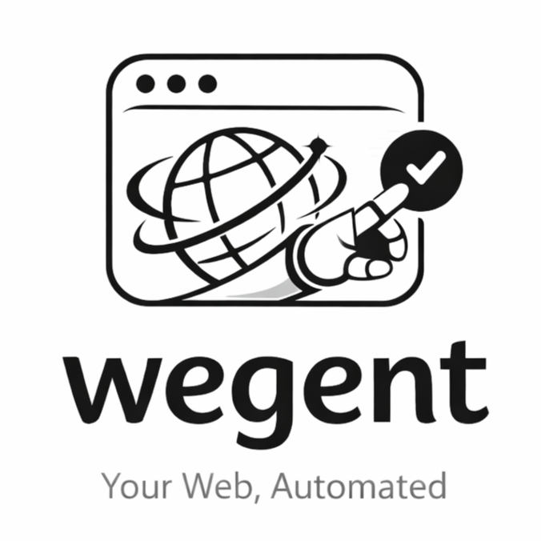
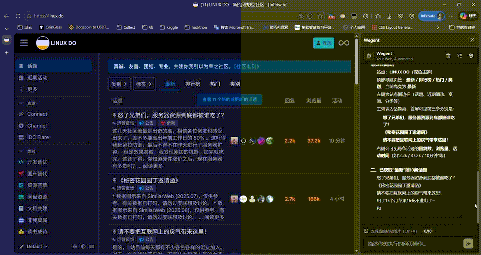

<table>
  <tr>
    <td width="190" align="center" valign="middle">
      
    </td>
    <td align="left" valign="middle">
      <h1>Wegent</h1>
      <!-- <p><em>Your Web, Automated.</em></p> -->
      <p>
        Wegent 是一个基于 <strong>Chrome Extension Manifest V3</strong> 的网页操作助手。<br/>
        支持远程MCP调用以及从skills.sh或部分GitHub仓库加载skill，内置浏览器操作工具集，并以可视化方式回传执行过程与结果。
      </p>
    </td>
  </tr>
</table>

---

## 目录

- [演示视频](#演示视频)
- [功能概览](#功能概览)
- [待完善列表](#待完善列表)
- [技术栈](#技术栈)
- [项目结构](#项目结构)
- [快速开始](#快速开始)
- [配置说明](#配置说明)
- [内置工具（DOM 操作）](#内置工具dom-操作)
- [定时任务](#定时任务)
- [MCP 与 Skill Packages](#mcp-与-skill-packages)
- [开发说明](#开发说明)
- [安全与合规](#安全与合规)
- [License](#license)

---

## 演示视频



---

## 功能概览

- 自然语言驱动网页操作（OpenAI 兼容 API）
- 结构化工具调用链路（tool call / tool result 可视化）
- 流式回复与 reasoning 展示
- 图片输入（粘贴上传）与多模态请求
- 定时任务（一次性 / 每 N 分钟，基于 `chrome.alarms`）
- MCP 服务器接入与工具发现
- Skill Package 导入、启用/禁用、刷新、删除
- 主题模式（浅色 / 深色 / 跟随系统）

---

## 待完善列表

- [ ] 对话任务的历史记录
- [ ] 更完善的浏览器调用功能
- [ ] 自动化定时任务暂未完全完善
- [ ] 添加项目原生 SKILL
- [ ] ......

---

## 技术栈

- React 19
- Vite 7
- Tailwind CSS 4
- Lucide React
- Chrome Extension MV3（Service Worker + Content Script + Side Panel）

---

## 项目结构

```text
use_dom/
├─ manifest.json                # Chrome 扩展清单
├─ background.js                # 后台 Service Worker（Agent 主流程、配置、定时任务、MCP/Skill）
├─ content.js                   # 页面工具执行（DOM 操作）
├─ icons/                       # 扩展图标
├─ image/                       # 文档与演示图片资源
├─ src/
│  ├─ App.jsx                   # 侧边栏应用入口
│  ├─ main.jsx                  # React 挂载入口
│  ├─ components/               # 聊天区、输入区、设置、MCP/Skill/定时任务组件
│  │  ├─ ai-elements/           # reasoning 等 AI 交互元素
│  │  └─ ui/                    # 通用 UI 组件
│  ├─ hooks/useChromeAgent.js   # 前端与 background 消息桥接
│  ├─ styles/index.css          # 全局样式
│  └─ utils/                    # markdown / skill 解析等工具
├─ sidepanel/                   # 构建产物（npm run build 自动生成）
└─ package.json                 # 项目脚本与依赖
```

---

## 快速开始

### 1) 安装依赖

```bash
npm install
```

### 2) 构建 Side Panel

```bash
npm run build
```

构建后会生成 `sidepanel/`，供扩展加载使用。

### 3) 在 Chrome 加载扩展

1. 打开 `chrome://extensions`
2. 开启「开发者模式」
3. 点击「加载已解压的扩展程序」
4. 选择项目根目录（包含 `manifest.json`）

### 4) 打开 Side Panel

- 点击扩展图标，或
- 使用快捷键：`Ctrl+B`（Mac 为 `Command+B`）

---

## 配置说明

在扩展「设置中心」可配置：

- `API Base URL`（OpenAI 兼容接口）
- `API Key`
- `Model`
- 推理参数：`maxLoops` / `maxTokens` / `temperature` / `topP`
- 多模态开关与图片细节级别（`auto` / `low` / `high`）
- 自定义系统提示词（System Prompt）

配置存储于：`chrome.storage.local` 的 `domAgentConfig`。

---

## 内置工具（DOM 操作）

- `navigate`
- `get_page_info`
- `get_elements`
- `get_page_content`
- `click`
- `type_text`
- `select_option`
- `scroll`
- `evaluate_js`
- `wait`
- `highlight`
- `take_screenshot`

这些工具由 `background.js` 调度，在 `content.js` 执行。

---

## 定时任务

支持两种触发方式：

- `once`：一次性在指定时间执行
- `interval`：每 N 分钟循环执行

特点：

- 触发时等价于“系统代替用户发送一条消息给 Agent”
- 使用当前活动标签页作为执行上下文
- 任务状态包含：`scheduled / running / success / failed / skipped`

---

## MCP 与 Skill Packages

### MCP

可在设置中添加远程 MCP 服务器（URL / API Key），并测试连接与查看可用工具。

### Skill Packages

支持通过 URL 预览并导入 Skill 包，支持：

- 启用/禁用
- 刷新（查看差异）
- 删除

> `scripts` 资源仅展示，不在扩展内执行。

---

## 开发说明

### 本地 UI 预览

```bash
npm run dev
```

该模式用于前端 UI 调试；不在扩展上下文时，消息会进入开发预览分支（模拟回复）。

### 开发约定

- 前端采用组件化拆分（ChatArea / InputArea / Header / Settings）
- 样式基于 Tailwind + 少量全局 CSS
- 消息流通过 `chrome.runtime.sendMessage` 与 `AGENT_UPDATE` 事件驱动

---

## 安全与合规

- 本项目用于浏览器自动化与交互增强，请仅在你有权限的页面和场景中使用。
- 涉及页面自动交互能力时，请遵守目标站点规则与当地法律法规。

---

## License

AGPL-3.0-only

> Notice：本仓库自首次提交起的全部代码（除特别注明第三方代码外）均按 AGPL-3.0-only 授权。
